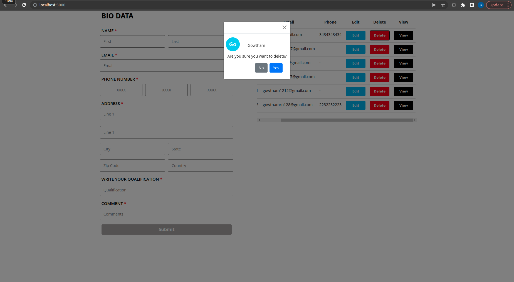
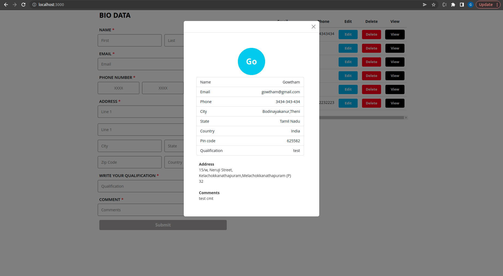

<a href="https://task1-19e79.web.app/">Demo - click here </a>

http://54.202.218.249:9501 - api is getting mixed content blocked on firebase live url. please try on your local or https://stackoverflow.com/questions/33507566/mixed-content-blocked-when-running-an-http-ajax-operation-in-an-https-page <a href="https://stackoverflow.com/questions/33507566/mixed-content-blocked-when-running-an-http-ajax-operation-in-an-https-page">Click</a> the link for fix the mixed content blocked issue.

